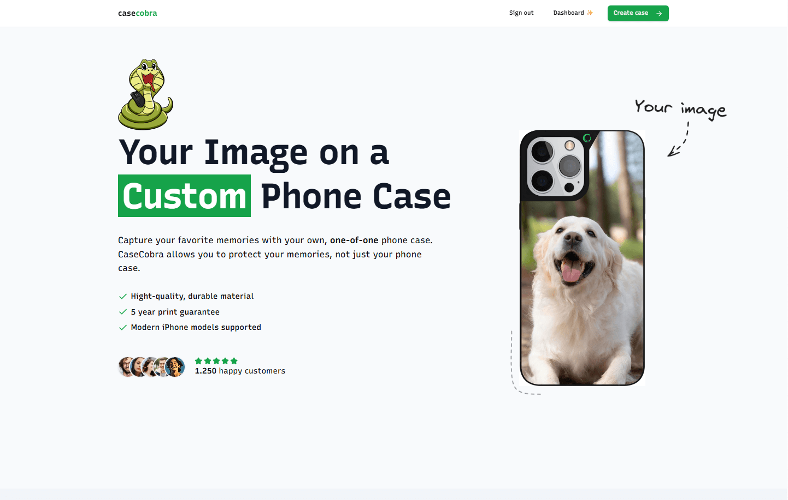
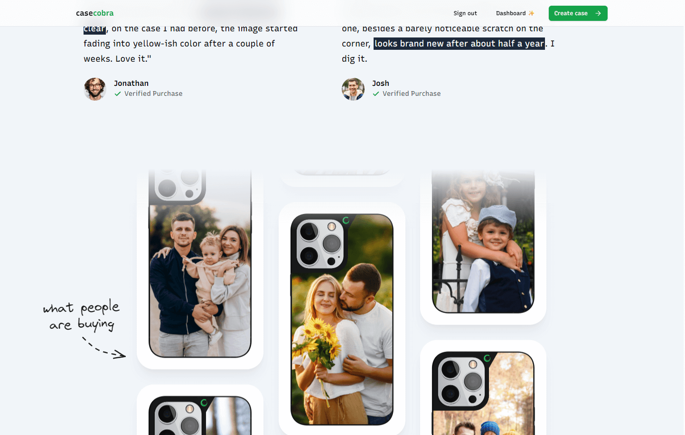
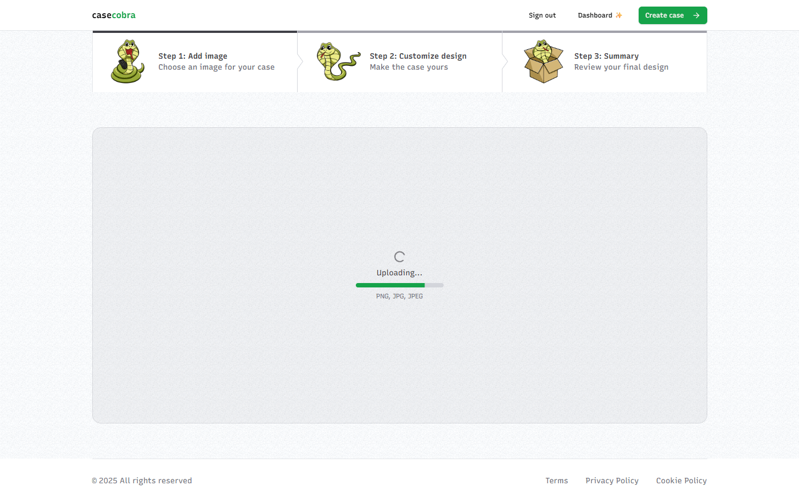
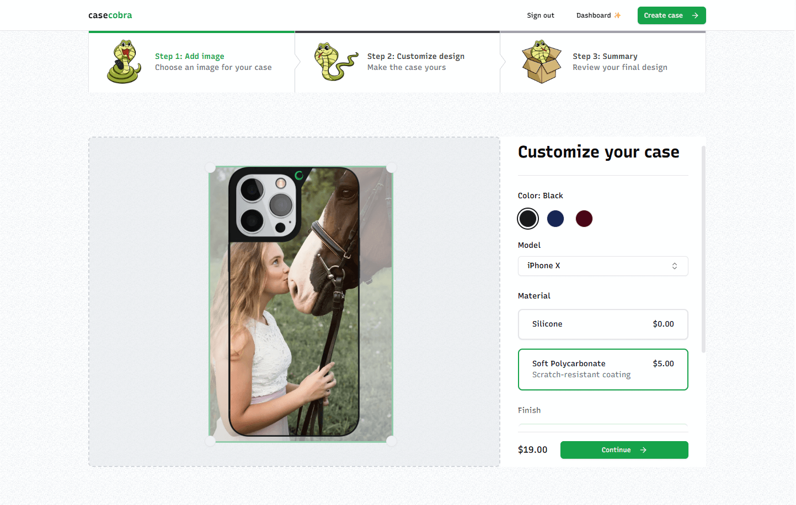
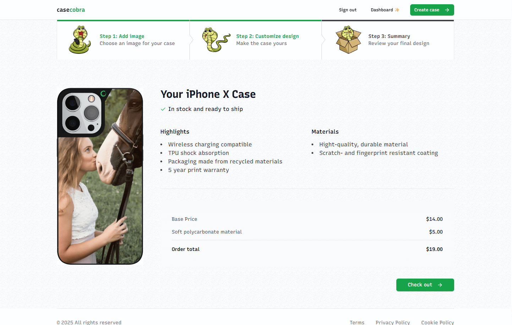
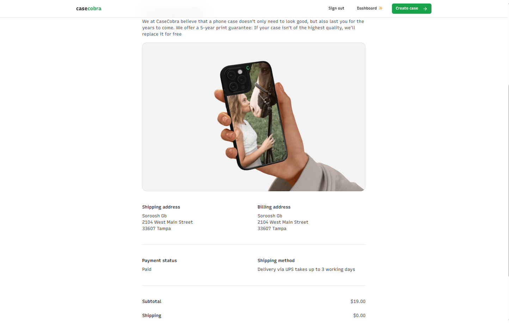

# 🛒 Modern E-Commerce Store

> Create your own custom phone case, preview it live, and order it — shipped straight to you. 📱📦


A full-stack e-commerce store built with **Next.js 14**, **Tailwind CSS**, **Shadcn UI**, **Stripe**, **Kinde Auth**, and **TypeScript** — featuring a custom phone case configurator, admin dashboard, and clean Apple-inspired design.

---

<p align="center">
  <a href="assets/0-part-of-home-page.png"></a>
  <a href="assets/1-part-of-home-page.png"></a>
  <a href="assets/2-configurator-step1.png"></a>
</p>
<p align="center">
  <a href="assets/3-configurator-step2.png"></a>
  <a href="assets/4-configurator-step3.png"></a>
  <a href="assets/5-thank-you-page.png"></a>
</p>


## 🚀 Getting Started

### 1. Prerequisites

- [Node.js](https://nodejs.org/)
- [pnpm](https://pnpm.io/)
- [Docker](https://docs.docker.com/get-docker/)

---

### 2. Clone the Repository

```bash
git clone <repo-url>
cd <repo-folder>
```

---

### 3. Set Up Environment Variables

Create a `.env` file in the root of the project and copy the contents of `.env.example` into it.

> This file includes all required credentials for local setup — such as Kinde, Stripe, UploadThing, Resend, and your database connection(next step will take care of the database). You'll need to sign up for those services and add the appropriate keys.

> ❗️You **must** fill out **all** values in `.env` before running the project — otherwise, the app will throw an error on startup.

---

### 4. Start PostgreSQL via Docker

This project uses a PostgreSQL container managed by Docker Compose:

```bash
docker-compose up -d
```

This will:

- Start a `postgres:17.0` container
- Map container port `5432` to your local machine’s `5432` by default

---

### ⚠️ Port Conflict Notice

If port `5432` is already in use on your machine, update both the Docker Compose file **and** the `DATABASE_URL` in `.env` to use a different port.

---

### 5. 📦 Install Dependencies & Set Up Database

Install dependencies:

```bash
pnpm install
```

Then set up the database schema:

```bash
pnpm db:push
```

You can explore the database with:

```bash
pnpm db:studio
```

---

### 6. 🔁 Set Up Webhook

To forward Stripe webhook events to your local server:

1. In **VS Code**, open the **Ports** tab.
2. Click **“Forward a Port”**, enter `3000`, then hit **Enter**.
3. After the URL is generated (e.g., `https://[random]-3000.use2.devtunnels.ms/`):
   - **Right-click** → **Make Port Public**
4. Copy the URL and set up a webhook in Stripe:

```
[YOUR_PUBLIC_URL]/api/webhooks/stripe
```

---

### 7. ✅ Run the Development Server

Start the dev server:

```bash
pnpm dev
```

---

### 💳 Test Payments

> To test a purchase in dev mode, use the test card number: `4242 4242 4242 4242`  

> You can enter any valid date, CVC, and name in the other inputs.

---